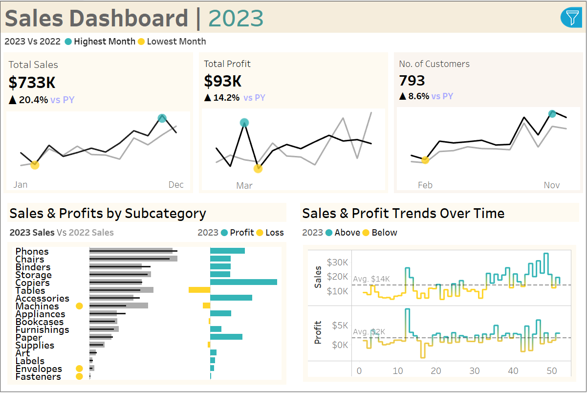

Interactive Tableau dashboard developed for a mid-sized retail supply chain business to monitor performance across sales, profit, and customer behavior. 

# Motivation
The client, operating in the consumer goods and retail segment, needed a dynamic solution to understand sales patterns, evaluate profitability by product category, and monitor customer acquisition throughout the year. Legacy reports were static and lacked actionable insights across KPIs like monthly performance, category-wise profitability, and customer engagement.
This project aimed to provide:
* A consolidated view of annual sales performance
* Insight into best- and worst-performing product subcategories
* Identification of monthly highs/lows to support promotional planning
* Trend analysis for smarter inventory and resource management

# Dataset
The dataset included detailed transaction records for the year 2023, capturing:
* Monthly sales and profit data
* Customer acquisition volume
* Key fields used: Date, Sales, Profit, Customer Count, Subcategory, Product Category

# Dashboard Highlights
1. Total Sales & Profit
   * Visual comparison of monthly performance vs. previous year
   * Marked high and low points to assess seasonal demand
  
2. Customer Trends
   * Monthly acquisition trend and growth % over the previous year
   * Helps gauge marketing and sales funnel effectiveness

3. Subcategory Breakdown
   * Comparative analysis of 2023 vs. 2022 performance by product line
   * Profit/loss visualization for quick diagnostics
  
4. Weekly Trend Analysis
   * High-resolution trend charts for both sales and profit
   * Insights into promotions, stockouts, or market behavior
  

# Tools & Tech Stack
* Tableau Desktop for dashboard development
* Calculated Fields for dynamic KPIs
* CSV/Excel datasets for input

# Key Outcomes
* Identified underperforming subcategories for potential SKU rationalization
* Detected periods of customer drop-offs and peak sales for calendar planning
* Enabled leadership to make informed decisions on seasonal campaigns and inventory control
* Delivered a single source of truth for sales and profitability tracking

# Summary / Takeaway
This Tableau dashboard empowered the client to move from reactive reporting to proactive decision-making. By visualizing trends and comparing year-over-year performance, the business was able to align better with market dynamics and drive revenue growth with improved clarity.

“This dashboard helped us shift focus from flat reports to focused action, especially in the way we manage product categories and track customer growth.” — Client Testimonial

Use Control + Shift + m to toggle the tab key moving focus. Alternatively, use esc then tab to move to the next interactive element on the page.
No file chosen
Attach files by dragging & dropping, selecting or pasting them.
Editing Tableau_Sales_Dashboard_Retail_-_Supply_Chain/README.md at main · ShaguftaPathan/Tableau_Sales_Dashboard_Retail_-_Supply_Chain
